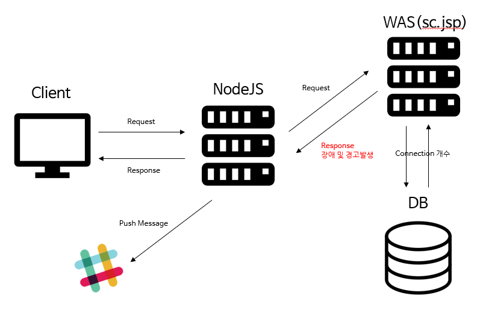

# 간단 모니터링 시스템

## 프로젝트 시작하게 된 동기

### 서비스에 대한 기본 규칙 중 하나인 신속한 오류 발견 및 해결의 모티브에 초점을 두었다. 재직중인 회사의 서비스 형태는 실시간 모니터링 개념이 아닌 유저가 서비스 이용시 오류를 발견하면 피드백을 주는 프로세스였다. 그래서 유저들의 불만사항도 쌓이고, 유지보수팀도 오류에 대응하는데 시간을 많이 소모했다. 이러한 문제점을 개선하기 위해서 개인 프로젝트를 시작했고, 주어진 기간은 2주였기 때문에 완벽한 시스템을 구성하지는 못했지만, 우리의 목적(?)인 실시간 모니터링을 한다는 것에 만족을 한 시스템이다.

<br/><br/>

## 시스템 구성환경

### 시스템 구성환경은 아래와 같다. 빠르게 개발하기 위해서 javascript를 채택하였다. 또한, 단순 네트워크 IO 입출력을 위한 시스템이기에 NodeJS를 사용해도 될 것이라 생각했다. 이 프로젝트의 목적성에는 현재까지는 부합하는 것 같다.

<br/>

|    분류    |      스택       | 참여(율) |
| :--------: | :-------------: | :------: |
|   백엔드   |    EpressJS     | O(100%)  |
| 프론트엔드 | Javascript(es5) | O(100%)  |

<br/><br/>

## 프로세스 흐름도

<br/>



<br/><br/>

## 기능

1. View에 표현할 데이터

   - JVM CPU 이용률
   - JVM Memory 이용률
   - JVM Thread 이용률
   - JVM DB 커넥션 수
   - 시스템 CPU 이용률
   - 시스템 Memory 이용률
   - 시스템 스토리지 이용률

2. 데이터 파일저장

3. 파일사이즈가 1GB이상일 때 파일압축

4. Web-Socket 통신

5. 오류 상태코드 파일저장

6. 5분 주기로 서버자원 요청

7. 오류발생시 슬랙푸쉬

8. postgreSQL, Oracle, mariaDB 지원

<br/><br/>

## 실제 화면

<br/>


<br/><br/>

## 이슈사항

1. 현재 agent가 따로 있는 것이 아니라 jsp파일이 그 역할(?)을 대신하기 때문에 특정 jsp 언어에 종속될 수 밖에 없음
2. DB 및 WAS 종류 및 버전에 제한이 있음
3. 프로그램 모니터링 시 해당 접속정보 관리 불편
4. 에러페이지 없음
5. 서버의 resource 및 DB 커넥션 수 등 필요 데이터를 receiver서버(NodeJS)가 setInterval 메소드로 구현하기에는 로직이 아름답지(?) 않음
6. 오라클은 변태(?)같애서 npm install 만으로 패키지 설치가 완성이 안됨([추가적인 작업필요](https://lts0606.tistory.com/183))
7. 에러처리

<br/><br/>

## 개선사항

### 투입기간이 짧았기 때문에 많은 고민을 하지않고 개발을 시작한 프로젝트였다. 그렇기에 고쳐야할 로직들이 보였다. 내용은 아래와 같다.

- 쉘 스크립트 또는 다른 방법으로 서버의 자원을 가져오도록 변경
- ORM이 있다면 적용
- 각 서버별 agent 설치 프로그램을 두어, 시간 간격을 두어 정보 수집

<br/><br/>

## 환경세팅

### 개발

```bash
git clone https://github.com/Hulkong/monitoring.git
cd ./monitoring
npm install
```

**[필수과정] info** 디렉토리에 각 초기정보 기입

- 오라클 라이브러리 설치는 npm install시 자동 설치가 안된다. 해결해야하지만 현 상태로는 다음 참조문서를 보고 추가진행을 해주어야 한다.  
  [참조문서](https://lts0606.tistory.com/183)
- DB-FOOL-INFO.js: 데이터 베이스 정보
- SERVICE-LIST.js: 화면에 필요한 데이터를 가져오기 위한 서비스 정보
- SLACK-INFO.js: 슬랙 webhook을 사용하기 위한 정보

```javascript
// SETTINGS DB-FOOL-INFO.js
// ex) { host: "localhost", port: "5432", type: "postgres", database: "postgres", user: "postgres", password: "password"}
module.exports = [
  {
    host: "host",
    port: "port",
    type: "DBMS type",
    database: "database",
    user: "user",
    password: "password",
  },
];

// SERVICE-LIST.js
module.exports = [
  {
    nm: "서비스명",
    usage: "용도",
    ip: "ip",
    port: "port",
    url: "url + /sc.jsp",
    virtualCore: "4",
    memory: "8GB",
    hardDisk: "100GB",
    os: "CentOS 7",
    jdk: "1.7.0_80",
    was: "Apche Tomcat",
    dbHost: ["database ip"],
    database: ["database name"],
    dbUser: ["database user"],
    type: ["postgres"],
  },
];

// SLACK-INFO.js
module.exports = {
  accessKey: "accessKey",
  channel: "channel name",
  username: "username",
  channelId: "channel Id",
  token: "token",
};
```

```bash
npm run dev
```

### 배포

```bash
# window 서버
npm run window

# linux 서버
npm run linux
```
